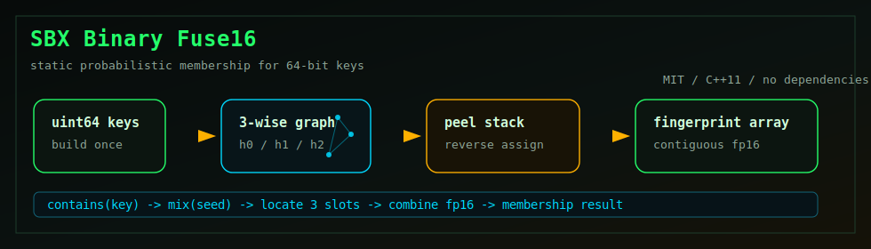

<div align="center">

# SBX Binary Fuse16

Compact static Binary Fuse filter for high-throughput 64-bit membership lookups.


[Русская версия](README.ru.md)

</div>



## What It Is

SBX Binary Fuse16 is a project-owned static probabilistic membership filter for
64-bit keys. It is designed for workloads that build a set once and perform a
large number of read-only lookups afterward.

The implementation uses 16-bit fingerprints and three positions per key. A
successful lookup means "possibly present"; a negative lookup is definitive.
The expected false-positive probability is approximately `1 / 65,536` under a
well-distributed 64-bit input hash.

## How It Works

1. Each key is mixed with a deterministic construction seed.
2. The resulting hash selects three vertices in a segmented 3-wise graph.
3. Degree-one vertices are peeled into a stack.
4. Fingerprints are assigned in reverse peel order.
5. Lookup reads three 16-bit slots and XORs them with the key fingerprint.

The construction retries with another deterministic seed when the graph cannot
be completely peeled. Duplicate input keys are detected through a fallback
deduplication pass.

## Design

- 64-bit input keys.
- 16-bit fingerprints.
- Three table positions per lookup.
- Segmented Binary Fuse layout.
- Deterministic seed sequence and bounded construction retries.
- Inline lookup path in the public header.
- Small-set and duplicate-key handling.
- No external runtime dependencies.

## Build

```bash
make
```

This builds:

```text
libsbx-binary-fuse.a
```

Manual build:

```bash
g++ -O3 -std=c++11 -c binary_fuse.cpp -o binary_fuse.o
ar rcs libsbx-binary-fuse.a binary_fuse.o
```

Clean generated files:

```bash
make clean
```

## Public API

```cpp
int sbx_binary_fuse16_build(SbxBinaryFuse16 *filter,
                            uint64_t *keys,
                            uint32_t count);

int sbx_binary_fuse16_contains(const SbxBinaryFuse16 *filter,
                               uint64_t key);

uint64_t sbx_binary_fuse16_estimate_bytes(uint32_t count);
void sbx_binary_fuse16_free(SbxBinaryFuse16 *filter);
```

`sbx_binary_fuse16_build()` returns `1` on success and `0` on allocation or
construction failure. The input array is mutable: a duplicate-key fallback may
sort and compact it during construction.

## Minimal Example

```cpp
#include "binary_fuse.h"

#include <cstdint>
#include <cstdio>

int main() {
  uint64_t keys[] = {
    UINT64_C(0x0123456789abcdef),
    UINT64_C(0xfedcba9876543210),
    UINT64_C(0x1122334455667788)
  };

  SbxBinaryFuse16 filter = {};
  if(!sbx_binary_fuse16_build(&filter, keys, 3)) {
    return 1;
  }

  uint64_t query = UINT64_C(0x0123456789abcdef);
  std::puts(sbx_binary_fuse16_contains(&filter, query)
              ? "possibly present"
              : "not present");

  sbx_binary_fuse16_free(&filter);
  return 0;
}
```

Build the example:

```bash
g++ -O3 -std=c++11 example.cpp binary_fuse.cpp -o example
```

## Memory Model

The finalized filter stores one contiguous `uint16_t` fingerprint array plus a
small metadata structure. Use the estimator before construction:

```cpp
uint64_t bytes = sbx_binary_fuse16_estimate_bytes(key_count);
```

The estimate covers the finalized fingerprint array. Construction also uses
temporary degree, XOR, queue, and peel-stack buffers, which are released before
`sbx_binary_fuse16_build()` returns.

## Threading

After a successful build, concurrent `contains()` calls are safe as long as the
filter remains read-only. Building or freeing the same filter concurrently is
not supported.

## Limits

- Static filter: insertions and deletions require rebuilding.
- Probabilistic membership: false positives are possible.
- Input count is represented by `uint32_t`.
- The filter owns its fingerprint allocation and must be released with
  `sbx_binary_fuse16_free()`.
- Copying a built `SbxBinaryFuse16` by value does not duplicate its allocation.

## Algorithm

The design follows the Binary Fuse construction described by Thomas Mueller
Graf and Daniel Lemire in
[Binary Fuse Filters: Fast and Smaller Than Xor Filters](https://arxiv.org/abs/2201.01174).
This repository contains its own MIT implementation and does not vendor the
authors' reference source code.

## Donate

If SBX Binary Fuse16 is useful to your work, you can support the project here:

**Bitcoin (BTC):** `1ECDSA1b4d5TcZHtqNpcxmY8pBH1GgHntN`

**USDT (TRC20):** `TUF4vPdB6QkjCvZq18rBL4Qj4dK5ihCN75`

## License

MIT License. See [LICENSE](LICENSE).
